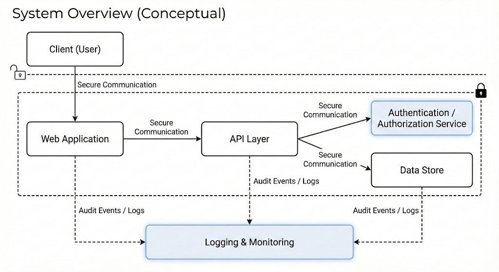

# 🔐 System Security & Infrastructure Case Study

เอกสารสรุปเชิงเทคนิคจากโครงงานเชิงวิชาการ  
จัดทำขึ้นเพื่ออธิบายแนวคิด กระบวนการคิด และสิ่งที่ได้เรียนรู้  
จากการวิเคราะห์ความเสี่ยงของระบบเว็บแอปพลิเคชัน  
และการออกแบบแนวทางยกระดับความมั่นคงปลอดภัย

เนื้อหาเน้นมุมมองด้าน **สถาปัตยกรรม ระบบ และการปฏิบัติการ (Operations)** โดยไม่ใช่เอกสารทางการ

> 📌 Repository นี้เป็น **docs-only case study**  
> เนื้อหามุ่งเน้นแนวคิด กระบวนการ และการตัดสินใจเชิงออกแบบ

---

## 🧾 ภาพรวมโดยย่อ

โครงงานนี้เริ่มจากการวิเคราะห์ระบบเว็บแอปพลิเคชันที่มีอยู่  
เพื่อระบุทรัพย์สินข้อมูลและพื้นผิวการโจมตีของระบบ  
จากนั้นประเมินความเสี่ยงในระดับโครงสร้าง  
และออกแบบแนวทางการยกระดับความปลอดภัยของระบบโดยรวม

ขอบเขตครอบคลุมตั้งแต่การยืนยันตัวตน การกำหนดสิทธิ์  
การปกป้องข้อมูล การรักษาความปลอดภัยของ Web / API  
ไปจนถึงการบันทึกเหตุการณ์และการเตรียมความพร้อมด้านโครงสร้างพื้นฐาน

---

## 🎯 เป้าหมายของ Case Study

- วิเคราะห์ความเสี่ยงด้านความมั่นคงปลอดภัยของระบบเว็บแอปพลิเคชัน
- กำหนดแนวทางการออกแบบความปลอดภัยในระดับสถาปัตยกรรม
- เสริมความปลอดภัยของข้อมูลและการเข้าถึงระบบ
- เพิ่มความสามารถในการตรวจสอบและติดตามเหตุการณ์ย้อนหลัง
- วางแนวคิดด้าน Infrastructure และการ deploy ระบบอย่างปลอดภัย

---

## 📦 ขอบเขตของงาน

- ระบบเว็บแอปพลิเคชันแบบ Client–Server
- การยืนยันตัวตนและการกำหนดสิทธิ์ผู้ใช้
- การจัดการข้อมูลอ่อนไหวและแนวคิดการออกแบบฐานข้อมูล
- Web / API Security
- Logging, Audit และ Monitoring
- แนวคิดด้าน Infrastructure และ CI/CD (เชิงออกแบบ)

---

## 🛠️ สิ่งที่ได้ดำเนินการ

- วิเคราะห์ระบบเดิมและจำแนกทรัพย์สินข้อมูล (Asset / Data Classification)
- ทำ Threat Modeling โดยใช้แนวคิด CIA Triad และ STRIDE
- ประเมินและจัดลำดับความเสี่ยง (Risk Assessment & Prioritization)
- กำหนดแนวทางและหลักการด้านความมั่นคงปลอดภัยของระบบ
- ปรับแนวคิดการจัดการสิทธิ์ผู้ใช้ด้วย RBAC และการยืนยันตัวตนหลายปัจจัย
- วางแนวทางการปกป้องข้อมูลอ่อนไหว
- ออกแบบแนวคิดการรักษาความปลอดภัยของ Web และ API
- กำหนดรูปแบบ Logging และ Audit Trail สำหรับเหตุการณ์สำคัญ
- พิจารณาการแยกสภาพแวดล้อมและแนวคิด CI/CD เพื่อการ deploy ที่ปลอดภัย

---

## 🔎 ประเด็นด้านความปลอดภัยที่ครอบคลุม

- Authentication & Authorization
- Session & Token Management
- Data Protection (in-transit / at-rest)
- Input Validation & API Hardening
- Rate Limiting & Abuse Prevention
- Logging, Monitoring & Incident Readiness
- Secure-by-design & Defense-in-depth
